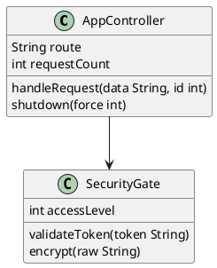

# Text2UML - PlantUML Diagram Generator

Generator diagramów UML z uproszczonej notacji PlantUML z autorskimi rozszerzeniami, wykorzystujący C++ (OGDF) skompilowany do WebAssembly. Projekt oferuje **trzy sposoby użycia**: aplikacja webowa z serwerem, standalone wersja w przeglądarce oraz command-line interface.

## Trzy dostępne wersje

### 1. **Web Server** (Node.js + Express)
**Lokalizacja:** `src/javascript/server/app.js`

Pełnowymiarowa aplikacja webowa z generowaniem diagramów po stronie serwera:
```bash
npm start
# Otwórz http://localhost:3000
```

**Cechy:**
- ✅ Generowanie SVG po stronie serwera
- ✅ Kompresja/dekompresja z biblioteką pako
- ✅ Szablony EJS do renderowania HTML
- ✅ Pełne API dla integracji
- ✅ Wszystkie funkcje: drag & drop, undo/redo, fix-position, config modal

**Kiedy użyć:** Gdy potrzebujesz aplikacji webowej z backendem, integracji z innymi systemami lub REST API.

### 2. **Standalone Browser Version** (Offline HTML)
**Lokalizacja:** `browser_version/index.html`

Kompletna aplikacja w jednym pliku HTML - działa całkowicie offline:
```bash
# Po prostu otwórz w przeglądarce
## Instalacja i budowanie

### Wymagania

- [Bazel](https://bazel.build/install) 5.3.2+
- [Node.js](https://nodejs.org/) 14+
- [Emscripten](https://emscripten.org/docs/getting_started/downloads.html) 3.1.23+

### Quick Start

```bash
# 1. Klonuj repozytorium
git clone <repository-url>
cd text2uml

# 2. Zainstaluj zależności Node.js
npm install

# 3. Zbuduj WASM backend
npm run build

# 4. Uruchom serwer
npm start
# → http://localhost:3000
```

### Szczegółowe komendy budowania

```bash
# Budowanie C++ → WASM
bazel build -c opt //src/cpp:generator
# lub
npm run build

# Bundling dla browser version
npm run rollup

# Czyszczenie projektu
npm run clean
```

## Struktura projektu

```
text2uml/
├── src/
│   ├── cpp/                      # Backend C++ (OGDF)
│   │   ├── generator.cpp/.hpp    # Główny generator
│   │   ├── config/               # Konfiguracja layoutów
│   │   ├── graph/                # Struktury grafowe
│   │   ├── image_builder/        # Budowanie SVG z algorytmami
│   │   ├── parser/               # Parsery PlantUML
│   │   └── utils/                # Narzędzia pomocnicze
│   │
│   └── javascript/               # Frontend + Server
│       ├── server/app.js         # Express server (główny)
│       ├── modules/              # Moduły (config, svg, memento)
│       ├── config/               # Szablony layoutów
│       ├── utils/                # Kompresja
│       ├── views/                # Szablony EJS
│       ├── assets/               # CSS, JS
│       ├── cli.js                # Command-line interface
│       ├── generator.js          # API generator
│       └── app.js                # Entry point
│
├── browser_version/              # Standalone HTML app
│   ├── index.html                # Kompletna aplikacja
│   ├── app.js                    # 998 linii logiki
│   └── uml-wasm.js               # WASM bundle
│
├── third_party/
│   ├── ogdf/                     # Graph algorithms
│   └── tinyxml2/                 # XML parser
│
├── BUILD                         # Bazel config
├── WORKSPACE                     # Bazel workspace
├── package.json                  # Node dependencies
├── CLI_USAGE.md                  # Dokumentacja CLI
└── README.md                     # Ten plik
```

## Użycie

### 1. Web Server

```bash
npm start
```

Otwórz http://localhost:3000 i:
- Wpisz kod PlantUML w textarea
- Wybierz diagram type, layout, edge type
- Kliknij **Render**
- Przeciągaj elementy (class diagram)
- Konfiguruj layout (przycisk **Config**)
- Zapisz SVG (przycisk 💾)
- Użyj **Fix Position** (📌) aby zablokować pozycje
- Użyj **Ctrl+Z/Y** dla undo/redo

### 2. Browser Version

```bash
# Otwórz w przeglądarce
open browser_version/index.html
```

Identyczna funkcjonalność jak server, ale:
- Działa offline
- Nie wymaga Node.js
- Jeden plik HTML

### 3. CLI

```bash
# Podstawowe użycie
node src/javascript/cli.js input.txt output.svg

# Z parametrami
node src/javascript/cli.js diagram.puml output.svg \
  --diagram-type class \
  --layout Sugiyama \
  --edge Bends \
  --config '{"nodeDistance": 100}'

# Prosty generator
nod## Custom PlantUML Directives

Text2UML rozszerza składnię PlantUML o dodatkowe dyrektywy:

### @position(x, y)
Ustawia pozycję elementu (może być zmieniona przez algorytm):
```plantuml
class Person {
' @position(100, 50)
  name: String
}
```

### @position_fixed(x, y)
Zablokowana pozycja - nie będzie zmieniana przez layout:
```plantuml
class Database {
' @position_fixed(0, 0)
  schema
}
```

### @layout_type
Określa layout dla diagramu:
```plantuml
' @layout_type Sugiyama
@startuml
class A --> B
@enduml
```

### @edge_type
Określa typ krawędzi:
```plantuml
' @edge_type Bends
@startuml
class A --> B
@enduml
```

## Przykład użycia



## Porównanie wersji

| Cecha                | Web Server               | Browser Version  | CLI                  |
| -------------------- | ------------------------ | ---------------- | -------------------- |
| **Hosting**          | Node.js (port 3000)      | Offline (HTML)   | Command line         |
| **Instalacja**       | npm install + npm start  | Otwórz HTML      | npm install          |
| **Generowanie**      | Server-side              | Client-side      | Server-side          |
| **Interaktywność**   | ✅ Pełna                 | ✅ Pełna         | ❌ Tylko generowanie |
| **URL sharing**      | ✅                       | ✅               | ❌                   |
| **Batch processing** | ❌                       | ❌               | ✅                   |
| **API**              | ✅ Express               | ❌               | ✅ Node.js module    |

## Dokumentacja

- **[CLI_USAGE.md](CLI_USAGE.md)** - Szczegółowa dokumentacja CLI
- **browser_version/index.html** - Kod źródłowy webowej version
- **src/javascript/server/app.js** - Kod źródłowy server version

## Troubleshooting

### "WASM module not found"
```bash
npm run build
npm run rollup
```

### "Port 3000 already in use"
Zmień port w `src/javascript/server/app.js`:
```javascript
http.createServer(app).listen(3001);
```

### SVG nie generuje się
```bash
# Sprawdź logi
npm run run > logs.txt 2> errors.txt
cat errors.txt
```

## Licencja
GNU GENERAL PUBLIC LICENSE Version 3
