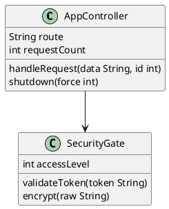

# Text2UML - PlantUML Diagram Generator

UML diagram generator from simplified PlantUML notation with custom extensions, using C++ (OGDF) compiled to WebAssembly. The project offers **three usage modes**: web application with server, standalone browser version, and command-line interface.

## Three Available Versions

### 1. **Web Server** (Node.js + Express)
**Location:** `src/javascript/server/app.js`

Full-featured web application with server-side diagram generation:
```bash
npm start
# Open http://localhost:3000
```

**Features:**
- ✅ Server-side SVG generation
- ✅ Compression/decompression with pako library
- ✅ EJS templates for HTML rendering
- ✅ Full API for integration
- ✅ All features: drag & drop, undo/redo, fix-position, config modal

**When to use:** When you need a web application with backend, integration with other systems, or REST API.

### 2. **Standalone Browser Version** (Offline HTML)
**Location:** `browser_version/index.html`

Complete application in one HTML file - works completely offline:
```bash
# Just open in browser
## Installation and Building

### Requirements

- [Bazel](https://bazel.build/install) 5.3.2+
- [Node.js](https://nodejs.org/) 14+
- [Emscripten](https://emscripten.org/docs/getting_started/downloads.html) 3.1.23+

### Quick Start

```bash
# 1. Clone repository
git clone <repository-url>
cd text2uml

# 2. Install Node.js dependencies
npm install

# 3. Build WASM backend
npm run build

# 4. Start server
npm start
# → http://localhost:3000
```

### Detailed Build Commands

```bash
# Building C++ → WASM
bazel build -c opt //src/cpp:generator
# or
npm run build

# Bundling for browser version
npm run rollup

# Clean project
npm run clean
```

## Project Structure

```
text2uml/
├── src/
│   ├── cpp/                      # C++ Backend (OGDF)
│   │   ├── generator.cpp/.hpp    # Main generator
│   │   ├── config/               # Layout configuration
│   │   ├── graph/                # Graph structures
│   │   ├── image_builder/        # SVG building with algorithms
│   │   ├── parser/               # PlantUML parsers
│   │   └── utils/                # Helper utilities
│   │
│   └── javascript/               # Frontend + Server
│       ├── server/app.js         # Express server (main)
│       ├── modules/              # Modules (config, svg, memento)
│       ├── config/               # Layout templates
│       ├── utils/                # Compression
│       ├── views/                # EJS templates
│       ├── assets/               # CSS, JS
│       ├── cli.js                # Command-line interface
│       ├── generator.js          # API generator
│       └── app.js                # Entry point
│
├── browser_version/              # Standalone HTML app
│   ├── index.html                # Complete application
│   ├── app.js                    # 998 lines of logic
│   └── uml-wasm.js               # WASM bundle
│
├── third_party/
│   ├── ogdf/                     # Graph algorithms
│   └── tinyxml2/                 # XML parser
│
├── BUILD                         # Bazel config
├── WORKSPACE                     # Bazel workspace
├── package.json                  # Node dependencies
├── CLI_USAGE.md                  # CLI documentation
└── README.md                     # This file
```

## Usage

### 1. Web Server

```bash
npm start
```

Open http://localhost:3000 and:
- Type PlantUML code in textarea
- Select diagram type, layout, edge type
- Click **Render**
- Drag elements (class diagram)
- Configure layout (**Config** button)
- Save SVG (💾 button)
- Use **Fix Position** (📌) to lock positions
- Use **Ctrl+Z/Y** for undo/redo

### 2. Browser Version

```bash
# Open in browser
open browser_version/index.html
```

Identical functionality as server, but:
- Works offline
- Doesn't require Node.js
- Single HTML file

### 3. CLI

```bash
# Basic usage
node src/javascript/cli.js input.txt output.svg

# With parameters
node src/javascript/cli.js diagram.puml output.svg \
  --diagram-type class \
  --layout Sugiyama \
  --edge Bends \
  --config '{"nodeDistance": 100}'

# Simple generator
node src/javascript/generator.js input.txt output.svg
```

## Custom PlantUML Directives

Text2UML extends PlantUML syntax with additional directives:

### @position(x, y)
Sets element position (can be changed by algorithm):
```plantuml
class Person {
' @position(100, 50)
  name: String
}
```

### @position_fixed(x, y)
Locked position - won't be changed by layout:
```plantuml
class Database {
' @position_fixed(0, 0)
  schema
}
```

### @layout_type
Specifies layout for diagram:
```plantuml
' @layout_type Sugiyama
@startuml
class A --> B
@enduml
```

### @edge_type
Specifies edge type:
```plantuml
' @edge_type Bends
@startuml
class A --> B
@enduml
```

## Usage Example



## Version Comparison

| Cecha                | Web Server              | Browser Version | CLI              |
| -------------------- | ----------------------- | --------------- | ---------------- |
| **Hosting**          | Node.js (port 3000)     | Offline (HTML)  | Command line     |
| **Installation**     | npm install + npm start | Open HTML       | npm install      |
| **Generowanie**      | Server-side             | Client-side     | Server-side      |
| **Interactivity**    | ✅ Full                  | ✅ Full          | ❌ Generate only  |
| **URL sharing**      | ✅                       | ✅               | ❌                |
| **API**              | ✅ Express               | ❌               | ✅ Node.js module |

## Dokumentacja

- **[CLI_USAGE.md](CLI_USAGE.md)** - Detailed CLI documentation
- **browser_version/index.html** - Web version source code
- **src/javascript/server/app.js** - Server version source code

## Troubleshooting

### "WASM module not found"
```bash
npm run build
npm run rollup
```

### "Port 3000 already in use"
Change port in `src/javascript/server/app.js`:
```javascript
http.createServer(app).listen(3001);
```

### SVG not generating
```bash
# Check logs
npm run run > logs.txt 2> errors.txt
cat errors.txt
```

## License
GNU GENERAL PUBLIC LICENSE Version 3
