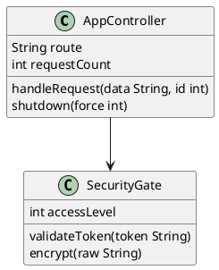

# Text2UML - Browser Version

Wersja przeglądarkowa Text2UML - generator diagramów UML z notacji PlantUML.

## Jak uruchomić

1. Otwórz plik `index.html` w przeglądarce (wystarczy dwukrotnie kliknąć na plik)
2. Aplikacja uruchomi się automatycznie i wygeneruje przykładowy diagram

## Funkcje

### Podstawowe funkcje
- **Automatyczne generowanie** - diagram generuje się automatycznie po załadowaniu strony
- **Edycja tekstu** - wpisz lub wklej kod UML w lewym panelu
- **Render** - kliknij przycisk "Render" aby wygenerować diagram z aktualnego tekstu
- **Save** - zapisz wygenerowany diagram jako plik SVG (przycisk 💾)

### Typy diagramów
- **Auto** - automatyczne wykrywanie typu diagramu
- **Class Diagram** - diagram klas z możliwością edycji pozycji
- **Activity Diagram** - diagram aktywności (bez edycji pozycji)

### Layouty (tylko dla Class Diagram)
- **Optimal Hierarchy** - optymalny układ hierarchiczny
- **Circular** - układ kołowy
- **FMMM** - Force-directed layout
- **Orthogonal** - układ ortogonalny
- **Sugiyama** - układ warstwowy Sugiyama
- **Tree** - układ drzewa

### Typy krawędzi
- **Curved (Bézier on existing points)** - krzywe Béziera na istniejących punktach
- **Polyline** - linie łamane
- **Curved (Bézier with new control points)** - krzywe Béziera z nowymi punktami kontrolnymi

### Konfiguracja layoutu
Kliknij przycisk **Config** aby otworzyć okno konfiguracji dla wybranego layoutu. Każdy layout ma swoje parametry (np. odległości między warstwami, między węzłami, itp.).

### Interaktywna edycja (tylko Class Diagram)
1. **Zaznaczanie** - kliknij na element SVG aby go zaznaczyć (czerwona ramka)
2. **Przeciąganie** - przeciągnij zaznaczony element myszką
3. **Strzałki** - użyj klawiszy strzałek aby precyzyjnie przesunąć element (5px na kliknięcie)
4. **Automatyczna aktualizacja** - pozycje są zapisywane jako komentarze `' @position(x, y)` w kodzie PlantUML

### Undo/Redo
- **Ctrl+Z** - cofnij ostatnią operację
- **Ctrl+Y** - ponów cofniętą operację
- Działa zarówno dla edycji tekstu (gdy fokus na textarea) jak i przesuwania elementów (gdy fokus na SVG)

### Współdzielenie i zapis stanu
Aplikacja automatycznie zapisuje stan w URL (tekst, ustawienia, konfiguracja) w skompresowanej formie. Możesz skopiować URL z paska przeglądarki i udostępnić go innym osobom - po otwarciu zobaczą dokładnie ten sam diagram z tymi samymi ustawieniami.

## Struktura projektu

```
browser_version/
├── index.html      - Główny plik HTML z interfejsem
├── app.js          - Cała logika aplikacji (wszystkie funkcje w jednym pliku)
├── uml-wasm.js     - Moduł WebAssembly (generator diagramów)
├── index.js        - Wrapper dla WASM
└── README.md       - Ten plik
```

## Wymagania

- Nowoczesna przeglądarka z obsługą WebAssembly (Chrome, Firefox, Edge, Safari)
- Połączenie internetowe (tylko do pobrania biblioteki pako z CDN)

## Przykładowy kod UML


