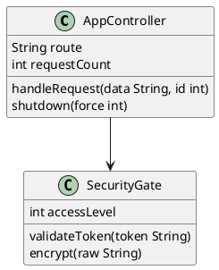

# Text2UML - Browser Version

Browser version of Text2UML - UML diagram generator from PlantUML notation.

## How to Run

1. Open the `index.html` file in a browser (just double-click the file)
2. The application will start automatically and generate a sample diagram

## Features

### Basic Features
- **Automatic generation** - diagram generates automatically after page load
- **Text editing** - type or paste UML code in the left panel
- **Render** - click the "Render" button to generate diagram from current text
- **Save** - save the generated diagram as SVG file (💾 button)

### Diagram Types
- **Auto** - automatic diagram type detection
- **Class Diagram** - class diagram with position editing capability
- **Activity Diagram** - activity diagram (without position editing)

### Layouts (Class Diagram only)
- **Optimal Hierarchy** - optimal hierarchical layout
- **Circular** - circular layout
- **FMMM** - Force-directed layout
- **Orthogonal** - orthogonal layout
- **Sugiyama** - Sugiyama layered layout
- **Tree** - tree layout

### Edge Types
- **Bends** - Bézier curves on existing points
- **Polyline** - polylines

### Layout Configuration
Click the **Config** button to open configuration window for the selected layout. Each layout has its own parameters (e.g., distances between layers, between nodes, etc.).

### Interactive Editing (Class Diagram only)
1. **Selection** - click on SVG element to select it (red border)
2. **Dragging** - drag selected element with mouse
3. **Arrow keys** - use arrow keys to precisely move element (5px per click)
4. **Automatic update** - positions are saved as comments `' @position(x, y)` in PlantUML code

### Undo/Redo
- **Ctrl+Z** - undo last operation
- **Ctrl+Y** - redo undone operation
- Works both for text editing (when focus on textarea) and moving elements (when focus on SVG)

### Sharing and State Saving
The application automatically saves state in URL (text, settings, configuration) in compressed form. You can copy the URL from browser address bar and share it with others - when they open it, they will see exactly the same diagram with the same settings.

## Project Structure

```
browser_version/
├── index.html      - Main HTML file with interface
├── app.js          - All application logic (all functions in one file)
├── uml-wasm.js     - WebAssembly module (diagram generator)
├── index.js        - Wrapper for WASM
└── README.md       - This file
```

## Requirements

- Modern browser with WebAssembly support (Chrome, Firefox, Edge, Safari)
- Internet connection (only to download pako library from CDN)

## Sample UML Code


